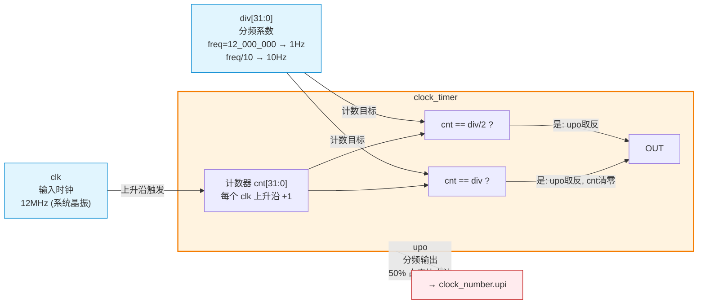
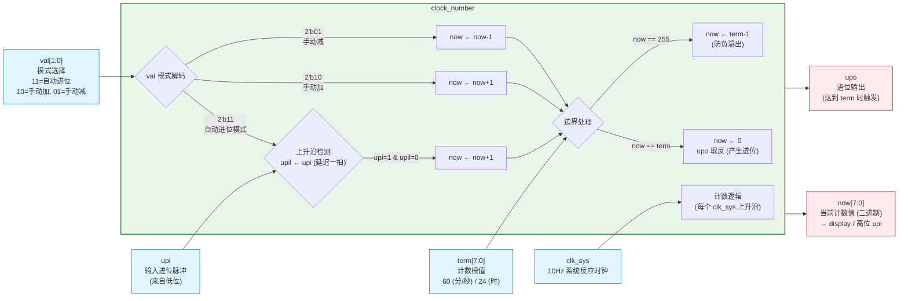
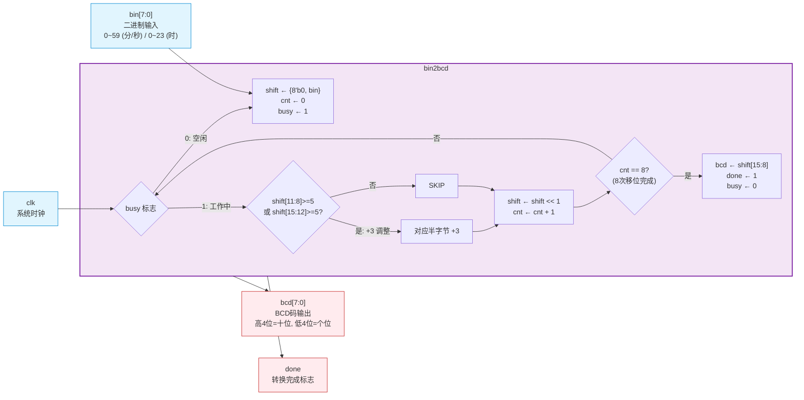
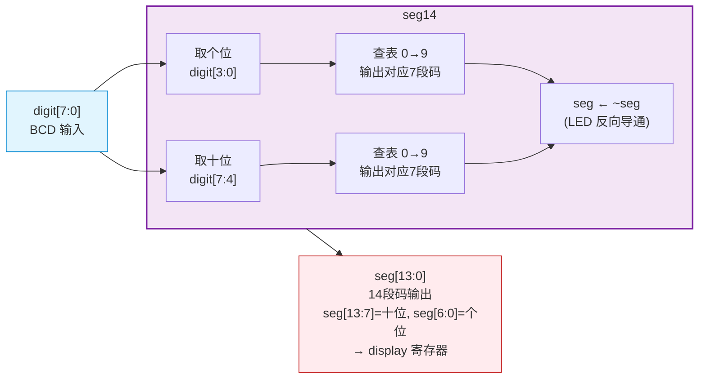
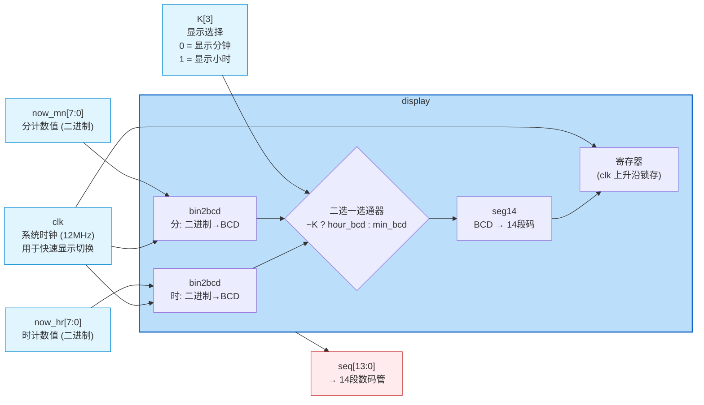
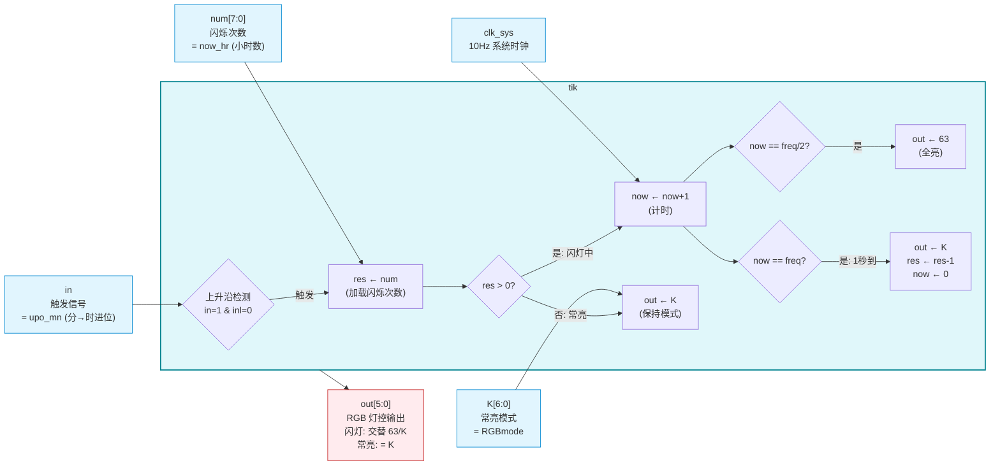
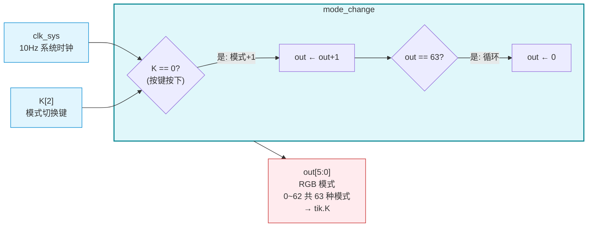
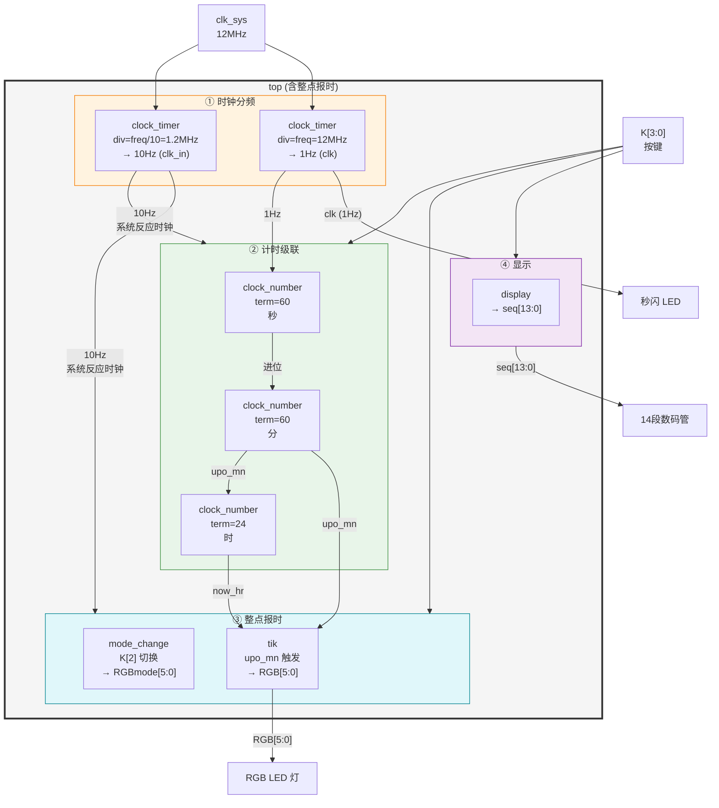

# 数字时钟 — 系统架构框图

> 基于 2K22 数电大作业 Verilog 实现

---

## 1. `clock_timer` — 时钟分频器

---

## 2. `clock_number` — 通用计数器

---

## 3. `bin2bcd` — 二进制转 BCD

---

## 4. `seg14` — BCD 转 14段码

---

## 5. `display` — 显示控制器

---

## 6. `tik` — 整点报时控制器（time_talker）

---

## 7. `mode_change` — RGB 模式切换

---

## 8. `top`（完整版）— 含整点报时的顶层系统

## 信号汇总（整点报时补充）

| 信号 | 位宽 | 方向 | 说明 |
|------|------|------|------|
| `RGB[5:0]` | 6 | 输出 | RGB LED 控制 (共 63 种模式) |
| `RGBmode[5:0]` | 6 | 内部 | 当前闪灯模式 (K[2] 切换) |
| `in` | 1 | 输入 | tik 触发信号 (= upo_mn) |
| `num[7:0]` | 8 | 输入 | tik 闪烁次数 (= now_hr) |
| `res[5:0]` | 6 | 内部 | tik 剩余闪烁次数 |
| `K[2]` | 1 | 输入 | 模式切换键 (RGB 循环) |

---

## 图例

| 颜色 | 含义 |
|------|------|
| 🔵 浅蓝 | **输入信号** — 来自外部或上层模块 |
| 🟠 橙色 | **时钟分频模块** |
| 🟢 绿色 | **计数器模块** |
| 🟣 紫色 | **显示处理模块** |
| 🔴 浅红 | **输出信号** — 送到外部或下层模块 |
| 🟡 米黄 | **控制逻辑** |
| ⚪ 灰色 | **顶层模块** (系统整合) |

## 信号汇总

| 信号 | 位宽 | 方向 | 说明 |
|------|------|------|------|
| `clk_sys` | 1 | 输入 | 12MHz 系统晶振时钟 |
| `K[3:0]` | 4 | 输入 | 按键: K[1:0]=加减, K[3]=时/分切换 |
| `clk` | 1 | 输出 | 1Hz 方波 (秒闪) |
| `seq[13:0]` | 14 | 输出 | 14段数码管显示 |
| `dig[1:0]` | 2 | 输出 | 数码管位选 (固定 2'b00) |
| `upi` | 1 | 内部 | 进位输入 (来自低位) |
| `upo` | 1 | 内部 | 进位输出 (到高位) |
| `now[7:0]` | 8 | 内部 | 当前计数值 (二进制) |
| `val[1:0]` | 2 | 内部 | 模式: 11=自动, 10=加, 01=减 |
| `term[7:0]` | 8 | 参数 | 计数模值: 60/24 |
| `div[31:0]` | 32 | 参数 | 分频系数 |
